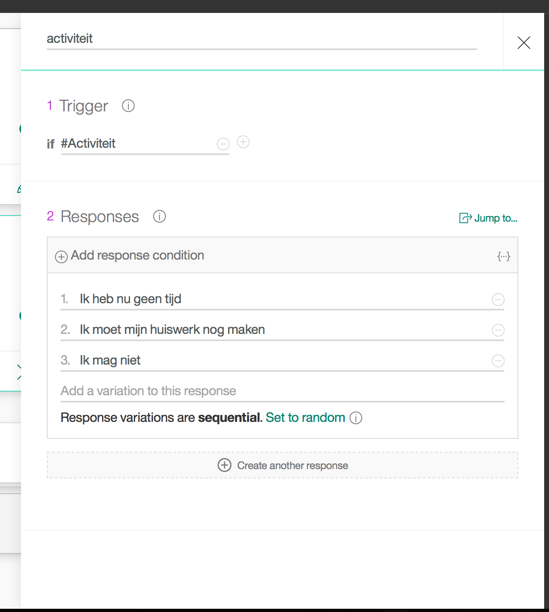

# Bouw je eigen facebook chatbot
De bedoeling is om een eigen facebook bot te maken zodat je er ook bent voor je vrienden als je zelf geen tijd hebt.
We gaan hierbij gebruik maken van IBM Watson. Je weet wel die beroemde quizer.

## Installeer je eigen bot applicatie op IBM Bluemix !

### I - Installeer in Bluemix

  Eerst en vooral moeten we een bot applicatie instaleren, dit kan gebeuren door op de bijbehorende button te klikken. Eerst moet je wel een usernaam en paswoord hebben op Bluemix. Indien je niet weet hoe dit moet vraag dan even een begeleider  

  Kies een naam voor je applicatie. De latere link naar de applicatie wordt dan https://jouwgekozennaam.bluemix.net/ Noteer deze naam ergens want je zal die later nodig hebben.

### II - Maak een nieuwe facebook pagina
  1. Om je bot te kunnen testen maak je een nieuwe pagina via https://www.facebook.com/pages/create/

  

  2. Kies een community pagina

  

  3. Geef de pagina een naam naar keuze. Als er nog tijd over is kan je de pagina straks ook versieren met wat fotos

### III - Maak een facebook applicatie
  1. Ga naar https://developers.facebook.com

  2. Log in met je facebook account en maak een nieuwe app.

  

  3. Kies App for Messenger en maak  een app ID. Kopieer dit app ID zodat je die hebt voor later.

  

  4. In het vakje token generation selecteer je, je net gemaakte pagina. Dit genereert automatisch een nieuw token. Bewaar dit token, je hebt dit later nodig.

  

  5. Kopieer dit token ergens zodat je het later kan gebruiken.

  6. Klik nu ook nog even op het dashboard. Kopieer de App Secret en bewaar die ook voor later.

  

### IV - Pas de configuratie van je Bot applicatie aan.
  1. Hiervoor moet je aanloggen in Bluemix http://www.bluemix.net

  2. In je dashboard zie je de aangemaakte applicatie. Herinner de naam die je voordien gekozen hebt.

  3. Klik op de applicatie

  

  4. Je ziet nu het dashboard van de applicatie. Selecteer hier runtime en environment variables.

  

  5. Scroll naar de onderkant van de pagina. Daar zie je een aantal invul velden. Hier ga je de informatie van de facebook applicatie invullen.

  

  6. Vul de volgende zaken in

      i) App Secret

      ii) Pagina token

      iii) /webhook1234

      Laat de 3 laatste velden op UNDEFINED staan

  7. Klik op save. Je applicatie zal nu herstarten.

### V - Koppel de facebook applicatie aan je bot
  1. Ga nu terug naar je Facebook App Klik op de button webhooks. Vul https://jouwgekozennaam.bluemix.net/messenger/webhook1234 in voor de callback url. Hierbij is de jouwgekozennaam de applicatie naam die je gebruikt hebt bij de installatie naar Bluemix.

   

  2. Vul als verify token abcd1234 in.

  3. Selecteer de opties messages, messages_deliveries, messaging_postbacks, and messaging_optins

  

  4. Subscribe je gecreerde pagina op dit event.

  

### VI - Maak nu een bot dialoog aan
  1. Hiervoor vertrek je opnieuw vanuit het Bluemix dashboard

  

  2. In het linker top menu kies je Services. Dit geeft je de lijst van services die je bot gebruikt. Klik op die met de naam wcm-conversation

  

  3. Click op de launch tool button. Dit opent een tool waarmee je de dialoog achter de bot kan wijzigen. Maak een nieuwe workspace aan kies, Dutch (Nederlands) als de taal.

  4. Voeg een aantal intents (Mogelijke types zaken die je bot kan behandelen). We gaan beginnen met 3 verschillende. Een die gewoon dag kan zeggen, een die mopjes kan vertellen en een derde die een excuus verzint als iemand een activiteit wil uitvoeren.

  5. Hievoor maak je volgende intents :

  i) Naam : #Hallo
        
  ii) Naam : #Activiteit
        
  iii) Naam : #Mop
        

  6. Test de intents. Dit kan je doen door rechts boven te klikken en dan in het vakje onderaan een boodschap te tikken. Merk op dat die niet exact moeten overeenkomen met de oorspronkelijke teksten. Dit is de kracht van artificiele inteligentie. De Watson conversation service heeft zichzelf getraind gebaseerd op jou voorbeelden.

  7. In sommige gevallen wil je ook nog onderwerpen toevoegen aan een bot gesprek. Hier zullen we vragen over welk onderwerp iemand een grap wil horen. Dit doe je door het toevoegen van entities. Voeg hier een aantal entities toe zoals hieronder.

    i) Naam : @Groen
        
    ii) Naam : @Banaan
          

  8. Nu kunnen we de dialoog uitwerken voor onze bot. In basis zullen we volgende dialoog bouwen

1. welcome. Maak eerst een welcome node aan. Deze moet exact "welcome" noemen aangezien hij dan aan het begin van een gesprek komt. Verder willen we dat deze node gebruikt wordt telkens als iemand groet. Vandaar de if #Hallo in de trigger. Dus telkens als iemand de #Hallo intent oproept zal de bot met een groet antwoorden.

2. activiteit. Hier zullen we de bot een excuus laten verzinnen waarom we niet willen deelnemen aan een acitviteit. Het belangrijke hier is weer de if trigger conditie.

3. mop. Deze tak is iets gecompliceerder daar we nog moeten vragen waar de mop moet over gaan. Deze node stelt een vraag en wordt dan gevolgd door verschillende nodes die mopjes bevatten over verschillende onderwerpen.

4. Maak nu ook nog nodes die overeenkomen met de onderwerpen die je vroeger gedefinieerd hebt.

5. Voeg ook nog een node toe die de gevallen opvangt waar iemand iets anders vraagt dan een van voorgaande topics.

  

6. Je kan nu ook weer met de knop rechtsboven de dialoog uit testen.

### VII - Link je bot met de dialoog

  1. We moeten nu nog de verbinding maken tussen de bot applicatie en de net aangemaakte dialoog. Dit doe je door middel van je workspace id. Via het menu linksboven kan je naar de workspace pagina. Klik op de .. bovenaan je worskspace en kies de detail optie.

  2. Noteer dit id.

  3. Voeg dit toe aan de environment variabelen van je bluemix applicatie. Dit is de laatste variabele WORKSPACE_ID.

## Gebruik nu Messenger om met je bot te praten
