# Build your own Facebook chatbot
The purpose is to build your own facebook bot so that you are also available for your friends even if you have no time. We use the IBM Watson. This famous quizer as you know.

## Install your own bot application on  IBM Bluemix !

### I - Install on Bluemix

  First we gone create the bot application. This can be done through the below button. You will need a userid on Bluemix to achieve this. If you don't know how to do this then ask one of the tutors.  

  Choose a name for your application. The link towards the application will be https://chosenname.bluemix.net/ Note this name as you will need it at a later stage.

### II - Create a new facebook page
  1. To test your bot you create a new page. This can be done through https://www.facebook.com/pages/create/

  

  2. Select community page

  

  3. Name the page. If time allows you can also enhance the page with some images later on.

### III - Create a facebook application
  1. Go to https://developers.facebook.com

  2. Log on with your facebook account and create a new app.

  

  3. Select App for Messenger and create an app ID. Copy this app ID as you need it in one of the next steps.

  

  4. In the part token generation you select the page you just created. This will generate a new token. Again keep this token as you will need it later on.

  

  5. Copy the token.

  6. Click on the dashboard link. Copy the App Secret and save it for later.

  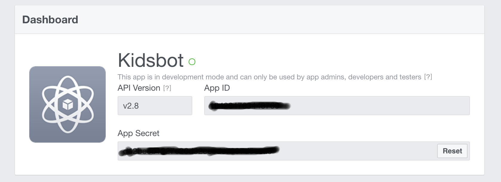

### IV - Adapt the configuration of your Bot application.
  1. To do this you have to logon to http://www.bluemix.net

  2. In the dashboard you see your created application. Remember the name you chosen before.

  3. Click on your application

  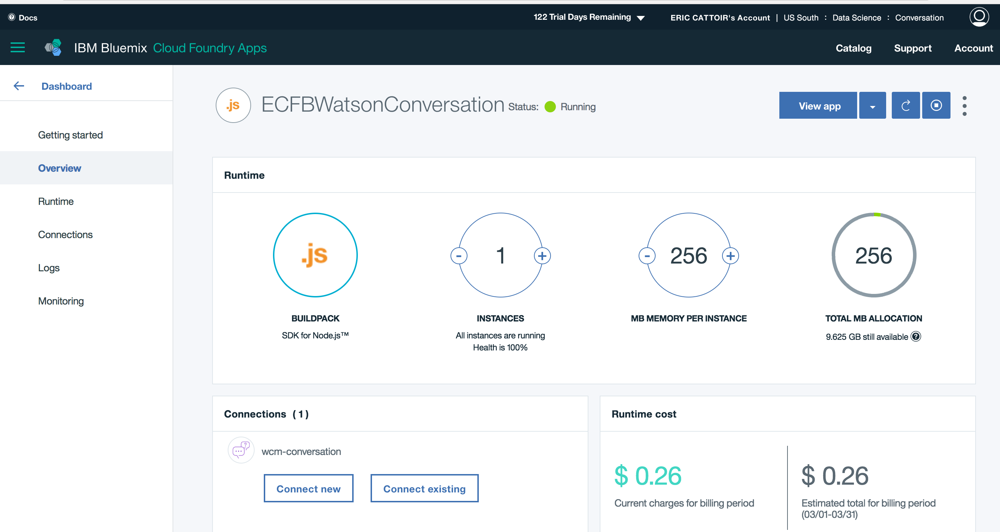

  4. You now see the dashboard of your application. Select runtime and environment variables.

  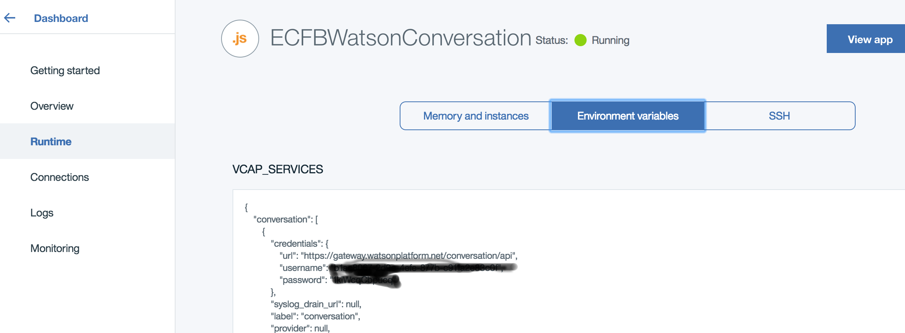

  5. Scroll to the bottom of the page. You see a number of fields where you will need to fill out the info about your facebook application.

  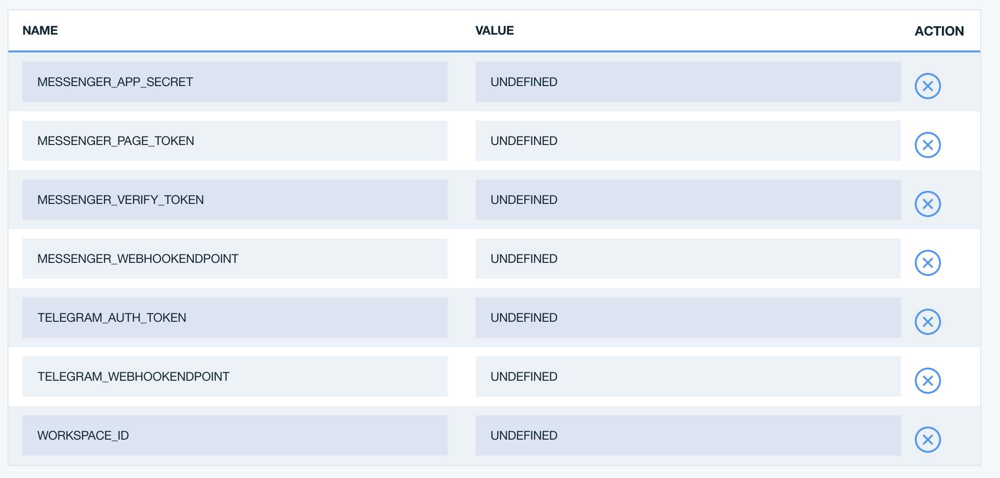

  6. Complete the following

      i) App Secret

      ii) Pagina token

      iii) /webhook1234

      Leave the last 3 fields as UNDEFINED

  7. Click on save. The application will now restart.

### V - Link the facebook application to your bot
  1. Switch back to your facebook app. Click on webhooks. Complete https://chosenname.bluemix.net/messenger/webhook1234 in the callback url. The chosenname should be replaced with the name you used at the creation of the Bluemix application.

   

  2. Use abcd1234 as verify token.

  3. Select the options messages, messages_deliveries, messaging_postbacks, and messaging_optins

  

  4. Subscribe your page to this event.

  

### VI - Create a bot dialog
  1. For this you again start from the Bluemix dashboard.

  

  2. In the left top menu select Services. This shows you the list of services the bot is using. Click on the one with the name wcm-conversation

  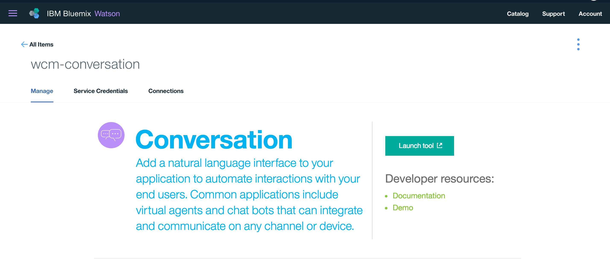

  3. Click on launch tool button. This opens a tool to edit the bot dialog. Create a new workspace and select English as language.

  4. Add a number of intents (Possible requests your bot can handle) Start out with 3. We gaan beginnen met 3. One to say hello, a second which can make a joke and a third that will find some excuse when somebody invites you for an activity.

  5. Create the following intents :

  i) Name : #Hello
        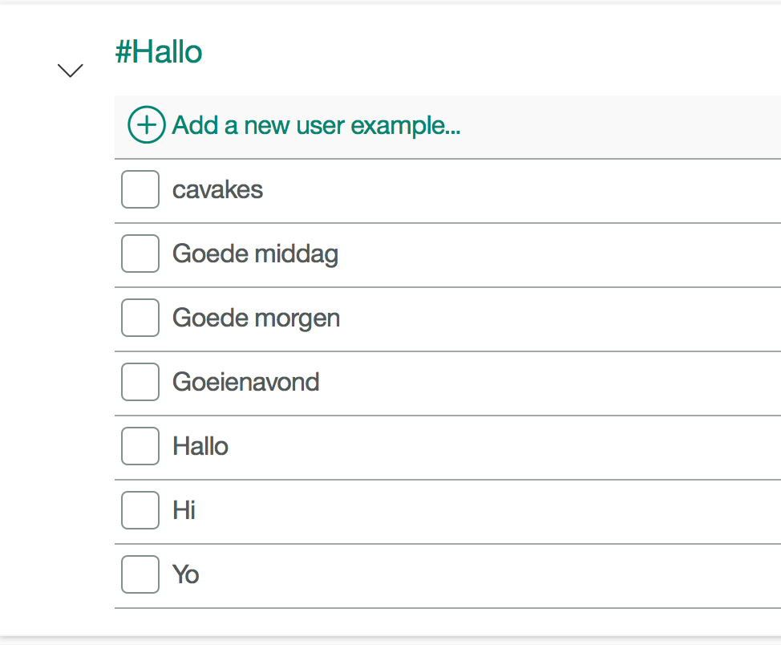
  ii) Name : #Activity
        
  iii) Name : #Joke
        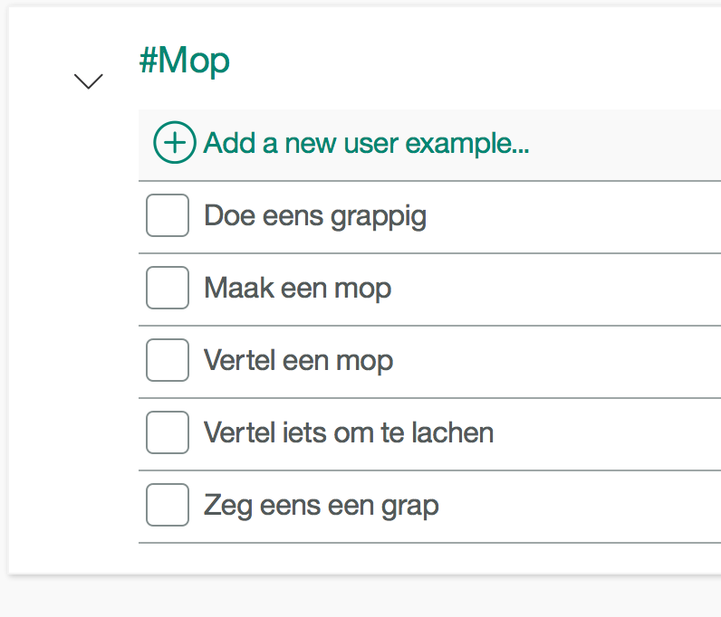

  6. Test the intents. This can be done by clicking on the right top and then entering some test messages in the bottom field. Notice that the texts don't need to be exact matches. This is the power of artificial intelligence. The Watson servide has trained itself based on your example messages.

  7. In some cases you want to add some subjects to the conversation. In this dialog we will ask about what subject someone wants to hear a joke. This is done by creating some entities. Add some like the examples below.

  i) Name : @Green
        
  ii) Name : @Banana
        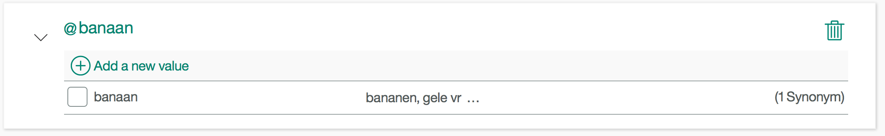  

  8. Now we can build the flow of the dialog for our bot. The basic flow is visible in below image.

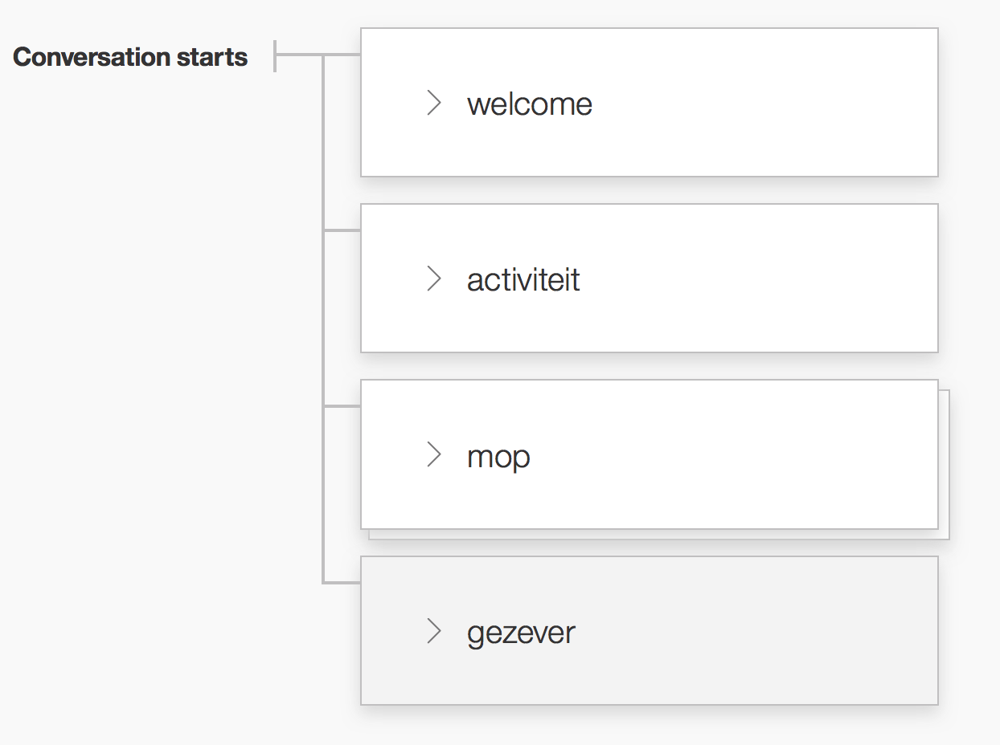

1. welcome. Create a welcome node. The name should be exactly "welcome" as then it will be the node which gets called at the begin of the dialog. Next we want to use this node when somebody greets the bot. Hence the if #Hello condition in the trigger. Each time someone invokes the #Hello intent the bot will answer back with a greeting.

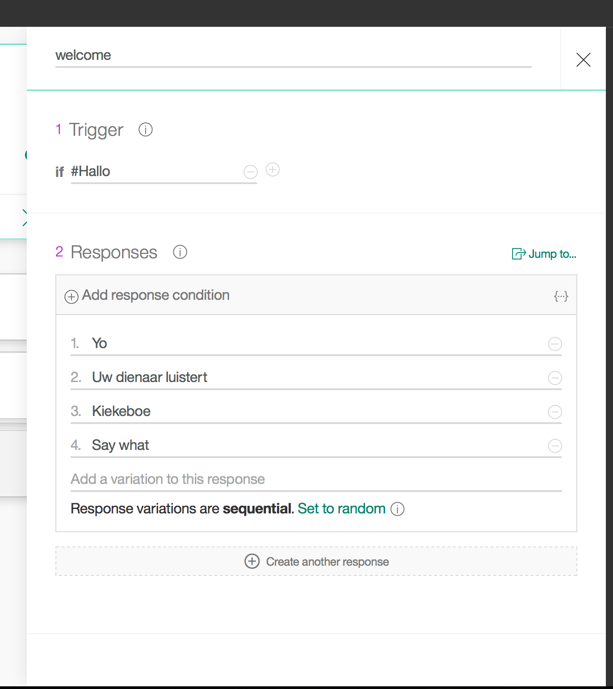

2. activity. Here we will have the bot come up with some excuse why we can't participate in an activity. Again the important piece is the trigger condition.

3. joke. This branch is more complicated as it also needs to question the subject of the joke. This node answers back with a question. It is then followed by a number of nodes wiht the different topics about which you have jokes. Corresponding to your entities.

4. Create nodes for each of the subjects.

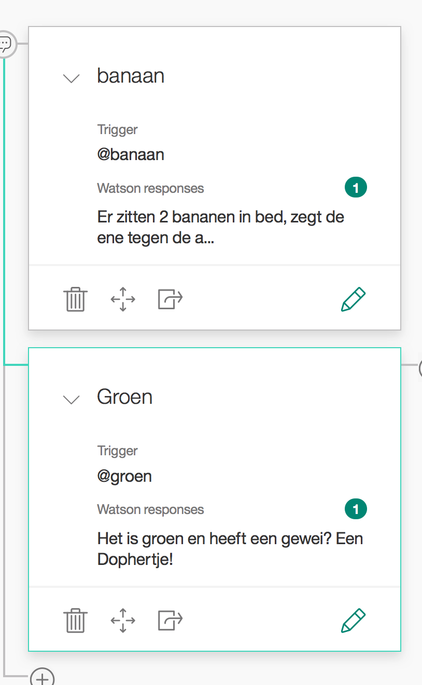

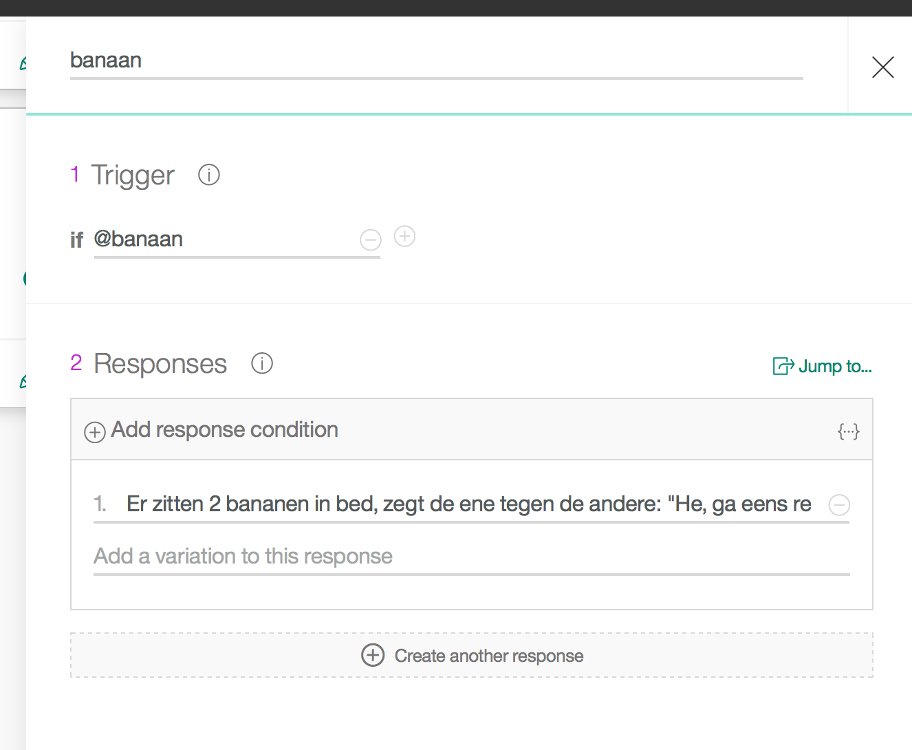

5. At last also add a node which will react whenever there is an unforseen question.

  

6. Test the dialog with the button on the right.

### VII - Link the bot to your dialog

  1.  Now we need to link the bot application with the dialog. This can be done through the workspace id. Through the menu on the left top you can go to the workspace page. Click on the .. at the top of your workspace en select details.

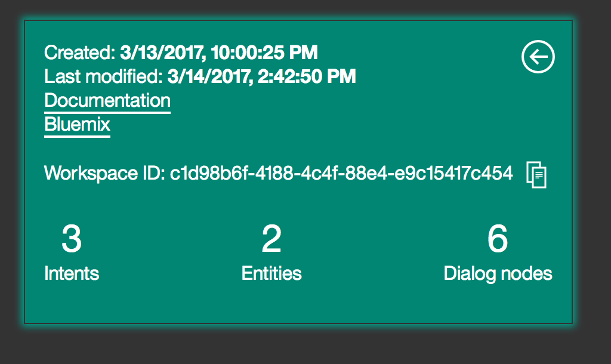

  2. Note the id.

  3. Add this id to the environment variables of your bluemix application. This is the last variable WORKSPACE_ID.

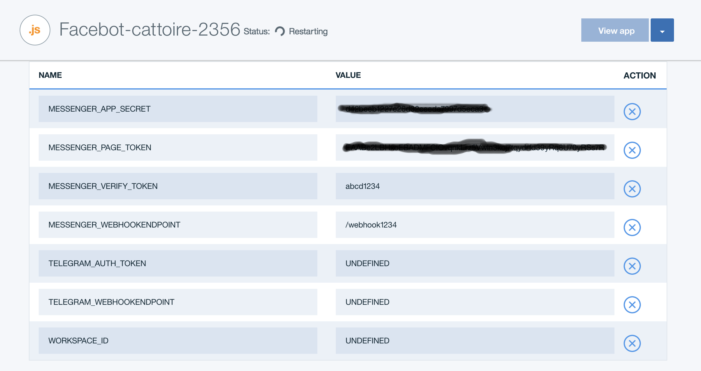

## Now use messenger to chat with the bot.
